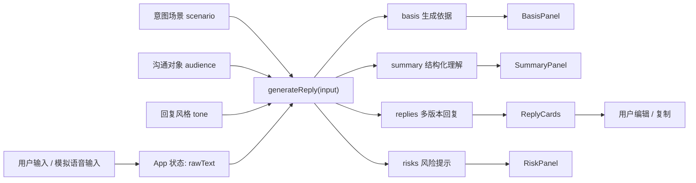
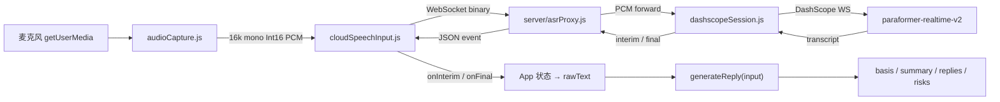

# VoiceFlow 开发架构示意文档

本文档用于说明当前 MVP 的工程结构、数据流、可替换能力点和下一步演进方向，方便 Claude Code 或评审确认项目不是一次性页面，而是可以继续工程落地的产品原型。

## 1. 当前工程定位

VoiceFlow 当前是一个 Vite React 单页应用，目标是验证"职场语音意图输入助手"的核心链路：

```text
口述意图（文本输入 / 真实语音输入 / 模拟样例）
  -> 选择意图场景、沟通对象和回复风格
  -> 生成依据展示
  -> 结构化理解
  -> 生成多版本职场回复
  -> 风险提示
  -> 编辑和复制
```

首版刻意采用 Mock 优先策略，不接真实 ASR 和真实 LLM。这样做的原因是：72 小时 MVP 需要先验证产品闭环和交互价值，而不是把风险集中在 API Key、网络、模型费用或识别稳定性上。

## 2. 目录结构

```text
.
├── README.md
├── ARCHITECTURE.md
├── voice-input-pm-analysis.html
├── 竞品分析报告-语音输入助手MVP.md
├── PRD-职场嘴替_v2.md
├── .env.example
├── package.json
├── vite.config.js
├── index.html
├── server/
│   ├── asrProxy.js
│   └── dashscopeSession.js
└── src
    ├── main.jsx
    ├── App.jsx
    ├── App.css
    ├── components
    │   ├── InputPanel.jsx
    │   ├── OptionControls.jsx
    │   ├── BasisPanel.jsx
    │   ├── SummaryPanel.jsx
    │   ├── ReplyCards.jsx
    │   └── RiskPanel.jsx
    ├── data
    │   └── examples.js
    └── lib
        ├── generateReply.js
        ├── generateReply.test.js
        ├── audioCapture.js
        ├── audioCapture.test.js
        ├── cloudSpeechInput.js
        └── cloudSpeechInput.test.js
```

核心边界：

| 模块 | 职责 | 后续是否可替换 |
|---|---|---|
| `App.jsx` | 页面状态编排、生成/清空/复制等交互、语境变化检测 | 可继续拆成 hooks |
| `components/*` | 展示和局部交互组件 | 可复用到后续真实 API 版本 |
| `components/BasisPanel.jsx` | 展示生成依据：意图场景、沟通对象、回复风格、解释文本 | 可复用 |
| `data/examples.js` | 五类意图场景演示样例，模拟语音输入 | 可扩展为 Demo 脚本库 |
| `lib/generateReply.js` | Mock 规则引擎，生成结构化结果、多版本回复、风险提示和生成依据 | 可替换为 LLM adapter |
| `server/asrProxy.js` | 本地 WebSocket 代理，转发音频到 DashScope 并回传结果 | 可替换为其他 ASR 代理 |
| `server/dashscopeSession.js` | DashScope WebSocket 会话管理、鉴权、事件映射 | 可独立替换 |
| `lib/audioCapture.js` | 麦克风采集 + 16k mono Int16 PCM 重采样 | MVP 用 ScriptProcessor，可升级 AudioWorklet |
| `lib/cloudSpeechInput.js` | 前端 WebSocket 客户端，连接本地代理收发事件 | 可替换为其他 ASR 适配器 |

## 3. 数据流



`generateReply(input)` 是当前最重要的工程接口：

```js
generateReply({
  rawText: string,
  scenario: 'progress' | 'request' | 'negotiate' | 'followup' | 'confirm',
  audience: 'leader' | 'peer' | 'client' | 'subordinate',
  tone: 'concise' | 'polite' | 'driving' | 'formal'
})
```

返回：

```js
{
  basis: {
    scenarioLabel: string,
    audienceLabel: string,
    toneLabel: string,
    explanation: string
  },
  summary: {
    conclusion: string,
    reason: string,
    time: string,
    nextStep: string
  },
  replies: {
    recommended: string,
    short: string,
    assertive: string
  },
  risks: string[]
}
```

这个接口已经具备清晰的替换边界：后续接入真实 LLM 时，UI 层不需要重写，只需要把 `generateReply` 替换为异步 adapter。

### 语音输入数据流（DashScope ASR）



真实 ASR 与 Mock 回复生成是两层独立能力：

- `audioCapture.js` 仅负责麦克风采集与 PCM 转换，不处理网络通信。
- `cloudSpeechInput.js` 仅负责与本地代理的 WebSocket 通信，不处理音频。
- `server/asrProxy.js` + `dashscopeSession.js` 管理 DashScope 会话，密钥在服务端。
- `App.jsx` 将转写结果追加到 `rawText`，复用现有语境变化检测和生成流程。
- `generateReply` 的输入参数和返回结构不受任何影响。
- 无密钥或网络失败时，自动降级为文本输入和演示样例。

### 第二阶段新增（PR #2）

在 PR #2 中新增了 `scenario` 参数和 `basis` 返回字段。五个场景 (`progress` / `request` / `negotiate` / `followup` / `confirm`) 各有独立的推断逻辑和风险检查规则。

当前阶段用户显式选择场景，作为 Demo 表达的一部分。未来当真实能力成熟后（LLM 能够可靠地判断口语意图归属），场景控件应收束为系统自动识别出的标签——用户只在系统判断错误时才需要手动纠正。

## 4. 当前能力与工程状态

已完成：

- React 单页应用。
- **真实语音输入**：麦克风采集 → 本地 Node 代理 → DashScope Paraformer 实时识别，录音状态展示、临时转写、连接/密钥/网络降级提示。
- Mock 语音输入样例（五类意图场景各一个）。
- 意图场景选择：同步进展、请求协作、拒绝协商、催促推进、确认回应。
- 沟通对象选择：领导、同事、客户、下属。
- 回复风格选择：简洁、礼貌、推进、正式。
- 生成依据展示：意图场景、沟通对象、回复风格、解释文本。
- 结构化提取：结论、原因、时间、下一步。
- 三版本回复：推荐版、简短版、增强推进版。
- 场景化风险提示：每类场景有独立的组织重点和风险检查规则。
- 语境变化检测：修改原始口述文本 (`rawText`)、场景 (`scenario`)、对象 (`audience`) 或风格 (`tone`) 后显示"语境已变化，请重新生成回复"。
- 推荐回复编辑与复制。
- README、ARCHITECTURE、PRD_v2、产品规划 HTML、竞品分析报告。
- Vitest 单元测试覆盖 generateReply 场景、音频采集、云语音会话、App 语音交互。

已验证：

```bash
npm test   # 57 passed (5 test files)
npm run build   # ✓ built
```

## 5. 为什么当前实现可以工程落地

当前项目不是把全部逻辑写在一个页面里，而是有明确可替换边界：

1. UI 与生成逻辑分离：组件只负责展示和交互，生成规则集中在 `generateReply.js`。
2. Mock 与真实能力可替换：ASR 和 LLM 都可以以后接入，不影响页面主结构。
3. 数据模型稳定：`rawText + scenario + audience + tone -> basis + summary + replies + risks` 可以覆盖 Mock、LLM、后端 API 三种形态。
4. 测试先覆盖核心价值：当前测试覆盖五类场景的正常路径、风险触发条件、空输入和参数默认值。
5. 文档链路完整：规划、竞品、README、架构文档分别服务产品判断、差异化说明、运行交付和工程评审。

## 6. 下一步方向建议

### 方向 A：接入真实 LLM（PR #4）

适合下一阶段做。

- 新增 `src/lib/replyAdapter.js`。
- 默认继续 Mock，配置环境变量后使用真实 LLM。
- 输出结构保持 `basis/summary/replies/risks`，避免改 UI。

价值：生成效果更自然，但需要处理 API Key、网络、费用、隐私说明。

### 方向 B：场景自动识别（远期）

当前用户显式选择意图场景。当 LLM 能力成熟后，可将 `scenario` 参数改为可选——系统自动推断意图分类，仅在置信度低或用户需要覆盖时才展示场景选择器。

## 7. 推荐下一步

建议优先做 **方向 A**（真实 LLM 接入）：

```text
DashScope ASR 语音入口已完成
  -> 接入真实 LLM 替代 Mock 规则引擎
  -> 默认 Mock、可切换 LLM
  -> PR #4
```
