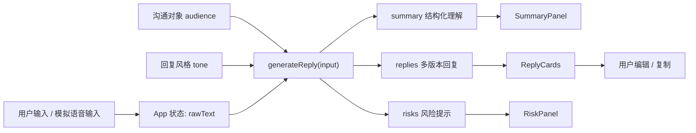

# VoiceFlow 开发架构示意文档

本文档用于说明当前 MVP 的工程结构、数据流、可替换能力点和下一步演进方向，方便 Claude Code 或评审确认项目不是一次性页面，而是可以继续工程落地的产品原型。

## 1. 当前工程定位

VoiceFlow 当前是一个 Vite React 单页应用，目标是验证“职场语音意图输入助手”的核心链路：

```text
口述意图 / 模拟语音输入
  -> 选择沟通对象和回复风格
  -> 结构化理解
  -> 生成多版本职场回复
  -> 风险提示
  -> 编辑和复制
```

首版刻意采用 Mock 优先策略，不接真实 ASR 和真实 LLM。这样做的原因是：72 小时 MVP 需要先验证产品闭环和交互价值，而不是把风险集中在 API Key、网络、模型费用或识别稳定性上。

## 2. 目录结构

```text
.
├── README.md
├── ARCHITECTURE.md
├── voice-input-pm-analysis.html
├── 竞品分析报告-语音输入助手MVP.md
├── package.json
├── vite.config.js
├── index.html
└── src
    ├── main.jsx
    ├── App.jsx
    ├── App.css
    ├── components
    │   ├── InputPanel.jsx
    │   ├── OptionControls.jsx
    │   ├── SummaryPanel.jsx
    │   ├── ReplyCards.jsx
    │   └── RiskPanel.jsx
    ├── data
    │   └── examples.js
    └── lib
        ├── generateReply.js
        └── generateReply.test.js
```

核心边界：

| 模块 | 职责 | 后续是否可替换 |
|---|---|---|
| `App.jsx` | 页面状态编排、生成/清空/复制等交互 | 可继续拆成 hooks |
| `components/*` | 展示和局部交互组件 | 可复用到后续真实 API 版本 |
| `data/examples.js` | 演示样例，模拟语音输入 | 可扩展为 Demo 脚本库 |
| `lib/generateReply.js` | Mock 规则引擎，生成结构化结果、回复和风险提示 | 可替换为 LLM adapter |
| `lib/generateReply.test.js` | 验证核心生成逻辑 | 后续保留为回归测试 |

## 3. 数据流



`generateReply(input)` 是当前最重要的工程接口：

```js
generateReply({
  rawText: string,
  audience: 'leader' | 'peer' | 'client' | 'subordinate',
  tone: 'concise' | 'polite' | 'driving' | 'formal'
})
```

返回：

```js
{
  summary: {
    conclusion: string,
    reason: string,
    time: string,
    nextStep: string
  },
  replies: {
    recommended: string,
    short: string,
    assertive: string
  },
  risks: string[]
}
```

这个接口已经具备清晰的替换边界：后续接入真实 LLM 时，UI 层不需要重写，只需要把 `generateReply` 替换为异步 adapter。

## 4. 当前能力与工程状态

已完成：

- React 单页应用。
- Mock 语音输入样例。
- 沟通对象选择：领导、同事、客户、下属。
- 回复风格选择：简洁、礼貌、推进、正式。
- 结构化提取：结论、原因、时间、下一步。
- 三版本回复：推荐版、简短版、增强推进版。
- 风险提示：时间、下一步、承诺、正式对象表达。
- 推荐回复编辑与复制。
- README、产品规划 HTML、竞品分析报告。
- Vitest 单元测试覆盖核心生成场景。

已验证：

```bash
npm test
npm run build
```

## 5. 为什么当前实现可以工程落地

当前项目不是把全部逻辑写在一个页面里，而是有明确可替换边界：

1. UI 与生成逻辑分离：组件只负责展示和交互，生成规则集中在 `generateReply.js`。
2. Mock 与真实能力可替换：ASR 和 LLM 都可以以后接入，不影响页面主结构。
3. 数据模型稳定：`rawText + audience + tone -> summary + replies + risks` 可以覆盖 Mock、LLM、后端 API 三种形态。
4. 测试先覆盖核心价值：当前测试验证客户报价延期、领导汇报延期、空输入三个关键场景。
5. 文档链路完整：规划、竞品、README、架构文档分别服务产品判断、差异化说明、运行交付和工程评审。

## 6. 下一步方向建议

### 方向 A：增强产品可信度

适合当前最优先推进。

- 增加更多职场意图类型：汇报延期、客户报价、催反馈、拒绝需求、请假交接、感谢确认。
- 增强风险提示规则：缺对象、缺时间、语气过硬、责任边界不清、承诺过度。
- 在界面中显示“为什么这样生成”，帮助评审理解产品逻辑。
- README 增加 Demo 脚本，方便录视频。

价值：不依赖外部 API，稳定提升 Demo 说服力。

### 方向 B：接入真实语音入口

适合第二阶段做。

- 新增 `src/lib/speechInput.js`，封装 Web Speech API。
- UI 增加真实录音按钮和浏览器兼容提示。
- 不支持 Web Speech API 时回退到文本输入和模拟语音输入。

价值：更接近“语音输入法”题面，但浏览器兼容性和权限会带来 Demo 风险。

### 方向 C：接入真实 LLM

适合第三阶段做。

- 新增 `src/lib/replyAdapter.js`。
- 默认继续 Mock，配置环境变量后使用真实 LLM。
- 输出结构保持 `summary/replies/risks`，避免改 UI。

价值：生成效果更自然，但需要处理 API Key、网络、费用、隐私说明。

### 方向 D：工程交付完善

建议和 A 同步做。

- 补充 GitHub 仓库提交。
- 按功能模块提交 commit。
- 在 README 放 Demo 视频链接位置。
- 增加截图或 GIF。
- 若需要部署，可用 GitHub Pages、Vercel 或 Netlify。

## 7. 推荐下一步

建议优先做 **方向 A + 方向 D**：

```text
先把 Demo 做得更像一个完整产品
  -> 增加职场场景和风险规则
  -> 补 README Demo 脚本
  -> 提交到 GitHub
  -> 录视频
```

原因：

- 当前项目最需要证明的是产品洞察和可演示闭环。
- Mock 优先路线已经确定，继续增强场景覆盖比过早接 API 更稳。
- 活动评审会看 README、Demo、commit、原创说明，这些比真实 ASR 更影响首轮观感。

真实语音和真实 LLM 可以作为 README 的 V2/V3 计划，也可以在基础 Demo 稳定后再接入。
